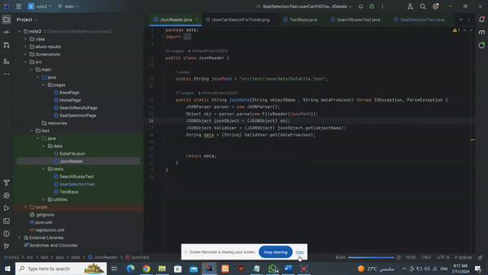

 # KSRTC Bus Booking Automation

## Selenium/Java/TestNG/Maven/Allure reports

This Selenium automation framework is designed to automate the bus booking process on KSRTC's website.

## Test Flow

1. Open [KSRTC Bus Booking Website](https://ksrtc.in/oprs-web/guest/home.do?h=1)
2. Select route from "CHIKKAMAGALURU" to "BENGALURU" from popular routes
3. Choose arrival date
4. Click "Search for bus"
5. Select a seat
6. Choose boarding and dropping points
7. Fill customer and passenger details  
8. Click "Make Payment" and fill payment details without submitting
   

 

 ## Features

- Built using Maven for easy dependency management and build automation
- Implements Selenium WebDriver for browser automation
- Utilizes TestNG for test execution and reporting
- Follows Java 8 coding standards
- Data-driven testing (DDT) using JSON files for test data
- Includes Allure reports for comprehensive test reporting
- Integration of takescreenshotclass for capturing screenshots on test failure

 
